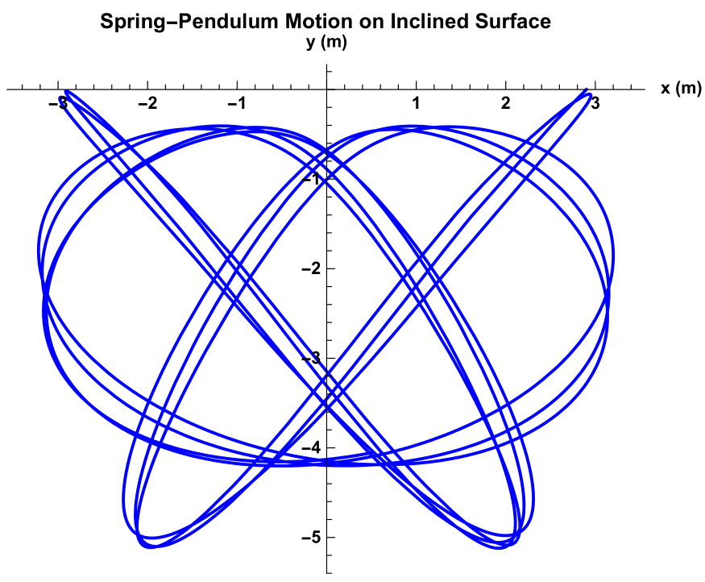
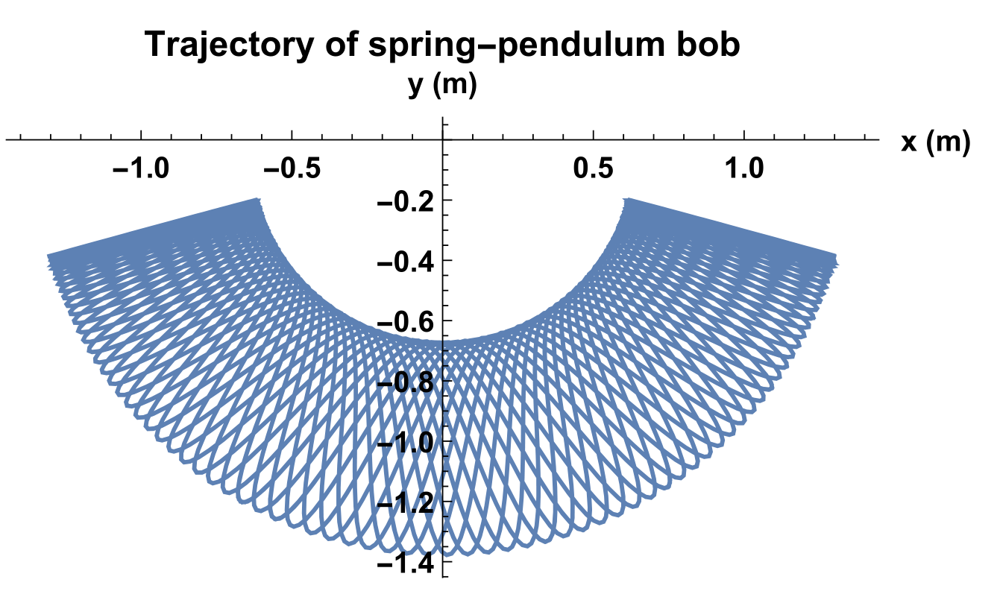
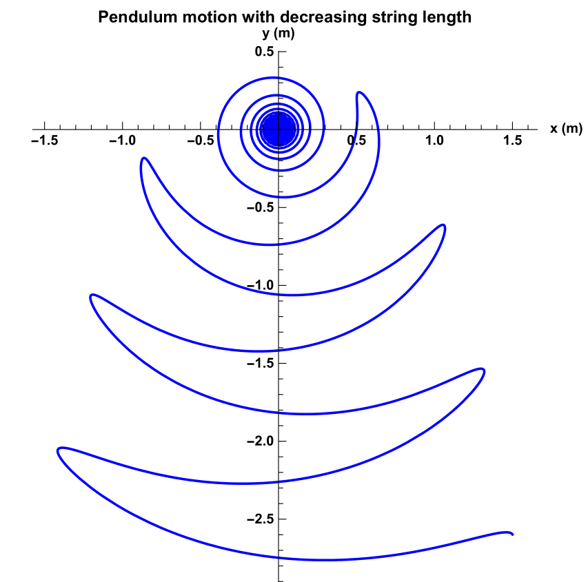

# Graphics-Physics-Renderings
Work area for my own projects researching into graphics, engine development, and computational physics

### Quantum orbital parametrization (Python & manim)

https://github.com/MichaelFabrizio/Graphics-Physics-Renderings/assets/83029804/61945edd-71f7-4d4d-8c4d-9c4ae5331d3b

https://github.com/MichaelFabrizio/Graphics-Physics-Renderings/assets/83029804/03ff178d-7f50-4cf4-9438-36e908ff9e9a

https://github.com/MichaelFabrizio/Graphics-Physics-Renderings/assets/83029804/025560e6-1497-4c9c-97e9-321ca9cde824

### Pendulum motions (Python, Numpy & Mathematica)
Calculated using Lagrangian Mechanics

